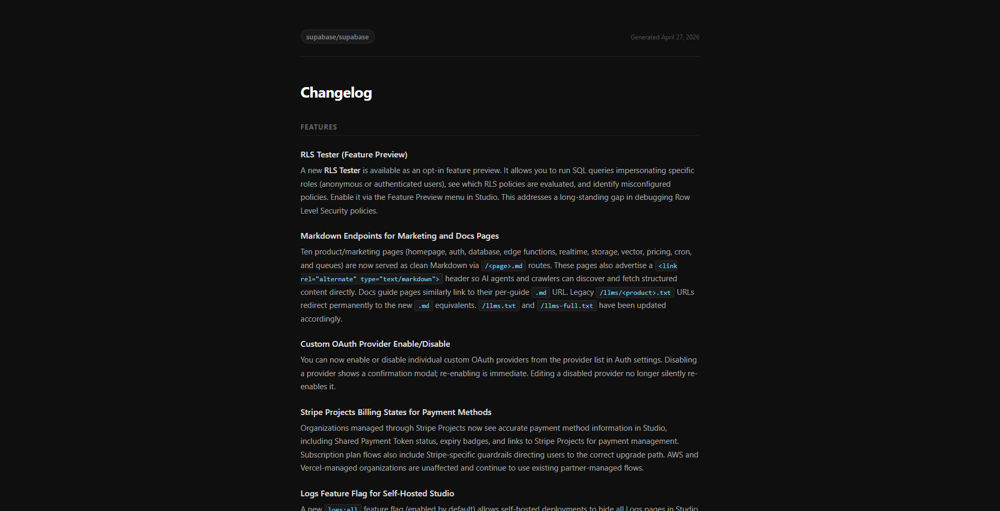

# Changelog Generator

Most "AI changelog" tools are just `git log | summarize`. This one actually 
reads your docs.

Built as a portfolio project inspired by [Doc Holiday](https://doc.holiday) 
by Sandgarden.



## How it works

1. **Fetch** — pulls the last 20 commits and their diffs from any public GitHub repo
2. **Discover** — automatically searches common docs paths (`docs/`, `documentation/`, 
   `website/docs/`, and more) so you don't need to know the repo structure upfront
3. **Retrieve** — scores discovered docs for relevance against the commits (RAG)
4. **Generate** — sends commits + relevant doc context to Claude, which produces 
   categorized, human-readable release notes
5. **Render** — outputs a formatted HTML changelog you can open in any browser

The RAG step is what separates this from a simple "summarize my commits" prompt. 
By grounding Claude in existing documentation, the output references what was 
previously documented, catches renames and deprecations in context, and produces 
entries that read like they were written by someone who actually knows the codebase.

If no docs are found, it degrades gracefully and generates without context — 
still useful, just less grounded.

## Stack

- TypeScript + Node.js
- Claude Sonnet (Anthropic) for generation
- Octokit for GitHub API
- Keyword-based RAG retrieval

## Setup

```bash
git clone https://github.com/boncz/changelog-generator
cd changelog-generator
npm install
```

Add a `.env`:
```bash
ANTHROPIC_API_KEY=your_key_here
GITHUB_TOKEN=your_token_here
```
## Usage

Point it at any public repo:

```bash
# Default (supabase/supabase, last 7 days)
npm start

# Any public repo
npm start -- --owner vercel --repo next.js

# Custom date range
npm start -- --owner facebook --repo react --days 30

# Override the docs path manually
npm start -- --owner supabase --repo supabase --docsPath apps/docs/content/guides
```

Output is saved to the `output/` folder as a styled HTML file.

## Known limitations & what's next

- **Shallow doc discovery** — the auto-detector finds top-level docs folders but 
  doesn't recurse into subdirectories. Repos that organize docs in nested structures 
  (like `docs/guides/auth/`) may only surface index files. A recursive crawler with 
  depth control is the right fix here.
- **Keyword retrieval** — relevance scoring is based on keyword overlap, not semantic 
  similarity. Vector embeddings would make retrieval meaningfully smarter.
- **20 commit cap** — currently fetches the most recent 20 commits. Configurable 
  limits and smarter batching for large repos would help.

## This is part of a series

- **Changelog Generator** ← you are here
- **[Doc Quality Evaluator](https://github.com/boncz/doc-quality-evaluator)** — LLM-as-judge framework for scoring documentation quality
- **[doctools-mcp](https://github.com/boncz/doctools-mcp)** — MCP server exposing doc tools to AI agents